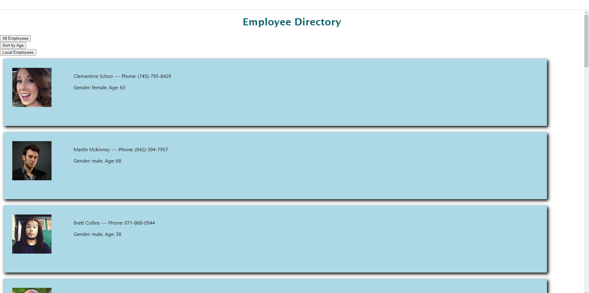

# Employee Directory

[Description](#description)

[Licence](#license)

[Installation](#installation)

[Usage](#usage)

[Dependencies](#dependencies)

[Contributing](#contributing)

[GitHub Link](#github-link)


## Description
View all employees in a company, as well as sort and filter by criteria.

### License
GNU General Public Licence

### Installation
`npm start` in the terminal will start the app.

### Usage
Use the buttons on the top of the page to view, sort and filter employees.  "All Employees" returns to the default state.

```
localEmployees = (e) => {
    const local = this.state.results.filter(emp => emp.location.country === "United States")
    console.log(local)
    this.setState({ display: local })
  }
```



### Dependencies
React, randomuser api

### Contributing
email Ryan at ryanpburnett@yahoo.com

### GitHub Link
github.com/ryanpburnett

The repo for this readme generator can be found on RPB's [Github](https://github.com/ryanpburnett/readme-generator) page.